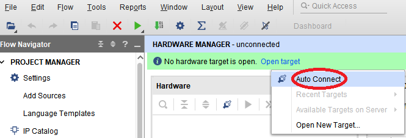
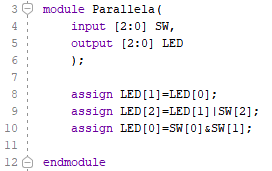
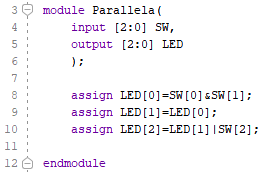
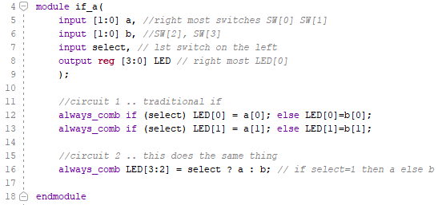
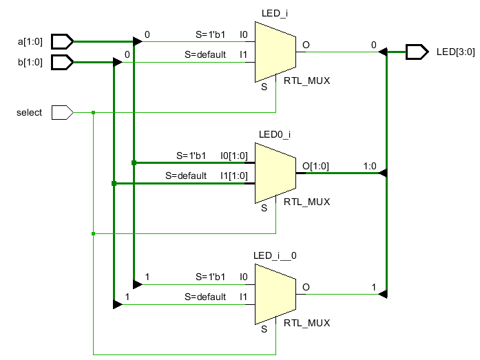
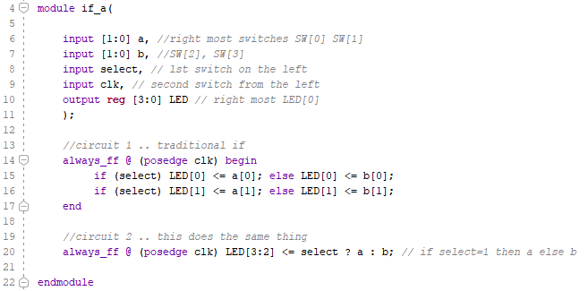
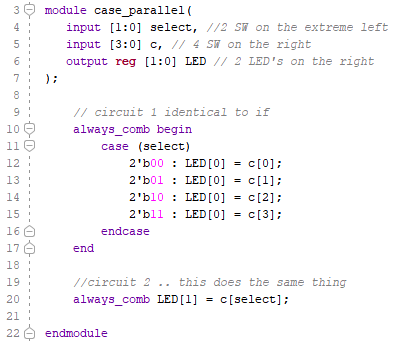

# FPGA Introduction


## Assumption you have some experience with Loops

If  Else  
While   
For  
Case    

## Goal

Explore how to circuits created using a C like programming language  called **Verilog**.   

## Requirements

Installed Vivado software from Xilinx  
This repository downloaded and unzipped  
A Nexys 4 DDR board from Digilent.   
Ability to move switches and watch LEDs.  

## Procedures

Take board out of the case. Foam is anti-static. Don't want to turn board on while on foam.  
Turn board off (if on), connect USB cable to computer first, then to the board second.  
Turn board on.   
Start Vivado.    
On left click on > PROGRAM AND DEBUG  
Click on > Open Hardware Manager  
Click on Open target    


Click on Auto Connect



Wait through two splash screens until this appears and click on Program Device


Click on the three dots


Navigate to the BitStream folder unzipped and choose the bit file 0_1_Hello World

## 0 Hello World

#### 0_1_HelloWorld


## 1 Parallel, Sequential, Non-blocking Programming

### Line order DOESN'T Matter

#### 1_1_Parallel_a




#### 1_1_Parallel_b




#### 1_1_Parallel_c


### Line order DOES Matter

#### 1_2_Sequential or Blocking


#### 1_3_Non_Blocking_clocked 

Non-Blocking or Non-Sequential has to be clocked.


## 2 Loops and Skips

Loops have to terminate when describing circuits. This means the **while** command **is not supported**. The while command  repeats an indeterminate number of times.  [Recursion](https://en.wikipedia.org/wiki/Recursion_(computer_science)) and more generally the [halting problem](https://en.wikipedia.org/wiki/Halting_problem) of software is not possible in hardware. Vendors will not implement this. 

Loops are implemented within **always_comb** create [combinational logic](https://en.wikipedia.org/wiki/Combinational_logic). Loops implemented within **always_ff** create [finite state machines](https://en.wikipedia.org/wiki/Finite-state_machine) and the [synchronous circuits](https://en.wikipedia.org/wiki/Synchronous_circuit)  of modern CPUs, GPUs, and ALUs. Leading edge [Neuromorphic](https://en.wikipedia.org/wiki/Neuromorphic_engineering) and [Asynchronous](https://en.wikipedia.org/wiki/Asynchronous_circuit#Asynchronous_CPU) CPUs are not supported.

#### 2_1_If_Parallel_combinational

The if command is the most heavily used. This circuit has two circuits sharing the same inputs and interpreting them in the same way.   This first circuit is demonstrating if's using the same selection criteria.





#### 2_1_if_Sequential_combinational


#### 2_1_if_parallel_clocked




#### 2_1_if_Sequential_clocked


#### 2_2_Case_combinational

It is really hard to find the difference between the case commands and if sequential commands. 




#### 2_2_Case_sequential_clocked


#### 2_3_For_Combinational

This turns a 4 digit hex number (0-15) into a 6 digit decimal number (tens, ones). But it doesn't scale. 


#### 2_3_Not_For_Clocked

C programmers may expect that nested For loops will work. They can be used to assign variables once within an always_ff, but this is not typically what a for loop does. Manual clock testing will wear out the physical switches on the Nexsy4 DDR board. Adding a clock will not work. If you try, the synthesizer will try to random things. 

The combinatory version may work, but will be come huge, ugly and unsustainable .. How would you grow it to 64 bits? 

So this version uses case and if commands and another concept that allows programs to grow arbitrarily large called Parameters. 

```
// from https://www.nandland.com/vhdl/modules/double-dabble.html
module Binary_to_BCD
  #(parameter INPUT_WIDTH = 7,
    parameter DECIMAL_DIGITS = 3,
    parameter s_IDLE              = 3'b000,
    parameter s_SHIFT             = 3'b001,
    parameter s_CHECK_SHIFT_INDEX = 3'b010,
    parameter s_ADD               = 3'b011,
    parameter s_CHECK_DIGIT_INDEX = 3'b100,
    parameter s_BCD_DONE          = 3'b101
    )
  (
   input                         clk, // this automatic, not manual
   input [INPUT_WIDTH-1:0]       i_Binary, // seven switches on the right of the board .. input hex
   input                         i_Start, // sw on far left that starts the calculation after hex is entered
   output [DECIMAL_DIGITS*4-1:0] o_BCD, // LED 7:0 on the right
   output                        o_DV   // LED 15 on the far left this is the overflow, carry 
   );
   
  reg [2:0] r_SM_Main = s_IDLE;
   
  // The vector that contains the output BCD
  reg [DECIMAL_DIGITS*4-1:0] r_BCD = 0;
    
  // The vector that contains the input binary value being shifted.
  reg [INPUT_WIDTH-1:0]      r_Binary = 0;
      
  // Keeps track of which Decimal Digit we are indexing
  reg [DECIMAL_DIGITS-1:0]   r_Digit_Index = 0;
    
  // Keeps track of which loop iteration we are on.
  // Number of loops performed = INPUT_WIDTH
  reg [7:0]                  r_Loop_Count = 0;
  wire [3:0]                 w_BCD_Digit;
  reg                        r_DV = 1'b0;                       
    
  always @(posedge clk)
    begin 
      case (r_SM_Main)  
        // Stay in this state until i_Start comes along
        s_IDLE :
          begin
            r_DV <= 1'b0;
             
            if (i_Start == 1'b1)
              begin
                r_Binary  <= i_Binary;
                r_SM_Main <= s_SHIFT;
                r_BCD     <= 0;
              end
            else
              r_SM_Main <= s_IDLE;
          end
                 
        // Always shift the BCD Vector until we have shifted all bits through
        // Shift the most significant bit of r_Binary into r_BCD lowest bit.
        s_SHIFT :
          begin
            r_BCD     <= r_BCD << 1;
            r_BCD[0]  <= r_Binary[INPUT_WIDTH-1];
            r_Binary  <= r_Binary << 1;
            r_SM_Main <= s_CHECK_SHIFT_INDEX;
          end          
         
        // Check if we are done with shifting in r_Binary vector
        s_CHECK_SHIFT_INDEX :
          begin
            if (r_Loop_Count == INPUT_WIDTH-1)
              begin
                r_Loop_Count <= 0;
                r_SM_Main    <= s_BCD_DONE;
              end
            else
              begin
                r_Loop_Count <= r_Loop_Count + 1;
                r_SM_Main    <= s_ADD;
              end
          end
                 
        // Break down each BCD Digit individually.  Check them one-by-one to
        // see if they are greater than 4.  If they are, increment by 3.
        // Put the result back into r_BCD Vector.  
        s_ADD :
          begin
            if (w_BCD_Digit > 4)
              begin                                     
                r_BCD[(r_Digit_Index*4)+:4] <= w_BCD_Digit + 3;  
              end
             
            r_SM_Main <= s_CHECK_DIGIT_INDEX; 
          end       
                
        // Check if we are done incrementing all of the BCD Digits
        s_CHECK_DIGIT_INDEX :
          begin
            if (r_Digit_Index == DECIMAL_DIGITS-1)
              begin
                r_Digit_Index <= 0;
                r_SM_Main     <= s_SHIFT;
              end
            else
              begin
                r_Digit_Index <= r_Digit_Index + 1;
                r_SM_Main     <= s_ADD;
              end
          end
         
        s_BCD_DONE :
          begin
            r_DV      <= 1'b1;
            r_SM_Main <= s_IDLE;
          end        
        default :
          r_SM_Main <= s_IDLE;
            
      endcase
    end // always @ (posedge clk)  
 
   
  assign w_BCD_Digit = r_BCD[r_Digit_Index*4 +: 4];
       
  assign o_BCD = r_BCD;
  assign o_DV  = r_DV;
      
endmodule // Binary_to_BCD 
```


3  